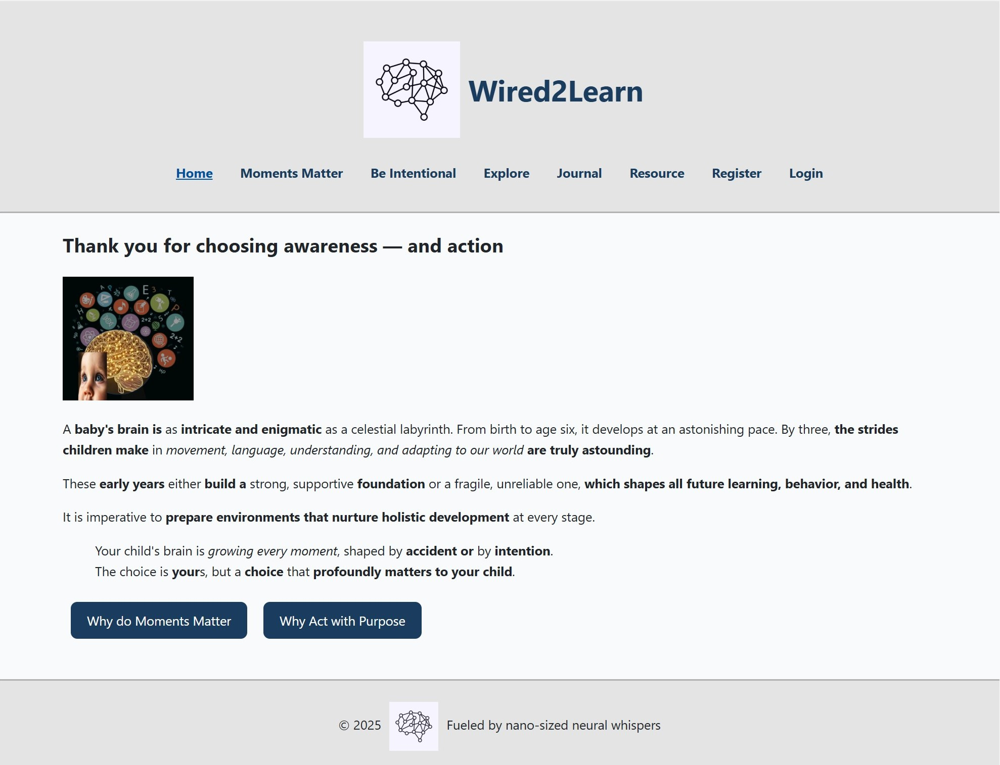

# Wired2Learn



---
## Project Description

**Wired2Learn** is an interactive full-stack application designed to *raise awareness* among new parents and caregivers *about how everyday interactions can shape a child's brain architecture*. It explores what learning and brain development look like during infancy and early childhood.  

The app includes pages like **Moments Matter** and **Be Intentional** to highlight why every moment and every choice the adult makes, matters to the child's growth and learning. Users can **explore** topics, access **resources**, and even keep a personal **journal**.  

The goal is to make early brain development science more **accessible and actionable**. By presenting curated resources in plain language and intuitive design, the app **empowers parents and caregivers** to explore and learn at their own pace.  

---
## Technologies Used

### Frontend  

- **React (Vite)** — component-based user interface
- **React Router DOM** — client-side routing
- **React Markdown** — render formatted content
- **CSS (External Stylesheets)** — responsive design with media queries
- **Node.js / npm** — package management  

### Backend  

- **Spring Boot** — Java-based REST API server
- **MySQL** — Relational database management
- **Spring Data JPA** — database ORM
- **Spring Web** — API endpoints
- **Maven** — dependency management and build tool

### Other Tools  

- **GitHub** — version control
- **Git Bash / VS Code** — development environment
- **MySQL Workbench** — database modeling and ERD creation
- **Trello** — project planning and tracking

---
## Installation and Setup Instructions  

Follow these steps to run **Wired2Learn** app locally:

### 1. Clone the Repository

- using GitBash,
  - fork the repository to your own GitHub account
  - clone the repository to your local machine


### 2. Frontend Setup

- Navigate to the frontend folder and install dependencies
    ```
    - npm install
    - npm run dev
    ```

- The React app will start on http://localhost:5173/  
- Type O and press Enter to start the application


### 3. Backend Setup

- Navigate to the backend folder
- Then, open the folder in your IDE such as IntelliJ IDEA

- #### Configure database  

  - Create a new MySQL database (wired2learn database) 
  - Update your credentials in *application.properties*
    ```
    spring.application.name=Wired2Learn
    
    spring.datasource.url=jdbc:mysql://localhost:3306/wired2learn
    spring.datasource.username=${DB_USER}
    spring.datasource.password=${DB_PASSWORD}
    spring.datasource.driver-class-name=com.mysql.cj.jdbc.Driver
    
    spring.jpa.hibernate.ddl-auto=update
    spring.jpa.show-sql=true
    spring.jpa.properties.hibernate.dialect=org.hibernate.dialect.MySQL8Dialect
    ```
  - Update/Create .env file in wired2learn folder under java-spring-boot-back-end-app folder

      ```
      DB_USER=<your_userid>
      DB_PASSWORD=<your_password> 
      ```

- #### Run the Spring Boot application  

  - Under java-spring-boot-back-end-app folder, navigate to
    - ```Wired2learnApplication.java ```
  - Run the application in your IDE 
  
    The backend will start on http://localhost:8080/

### 4. Test the full-stack connection

- Once both servers are running:  

  - Frontend:   http://localhost:5173/
  - Backend:  http://localhost:8080/

- Use the browser tab where the application has started and explore the application

### 5. List of API endpoints and their purpose

- Registration Page - Create a User
- Login Page - Authentication of a User
- Resource Page - Get List of Resources
- Journal Page for a User 

  - Create a Journal Entry
  - Modify a Journal Entry
  - Delete a Journal Entry
  - Get List of Journal Entries
---
## Links to Design and Architecture

- [User Flows and Wireframes](https://drive.google.com/file/d/1rmFMrgY_NfoZtzoLFxJx0pCn1Ah8lm6V/view?usp=drive_link)
- [Entity Relationship Diagram](https://drive.google.com/file/d/1sbWs52ZRj8RTaOUzqk0FRpdPMZkHVa9E/view?usp=drive_link)

---
## Future Features and Enhancements

- Implement a functional database integration to dynamically host and manage content for the Explore page.
- Enable registered users to mark and save favorite resources for quick access and personalized recommendations.
- Add curated scientific literature to Resource Page.
- Add more topics to Explore Page.
